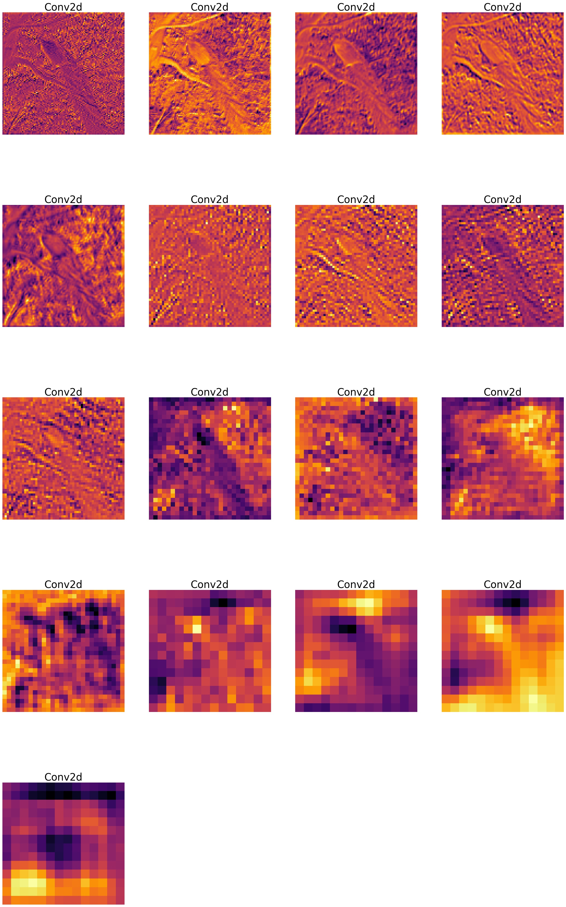

In the SimCLR directory you will find the adapted implementation of SimCLR to be able to pre-train the Conformer model in a self-supervised way.

To pretrain a conformer model using SimCLR

### Pre-Training conformer encoder:
Simply run the following to pre-train a ResNet encoder using SimCLR on the CIFAR-10 dataset:
```
python main.py --dataset CIFAR10 --model conformer
```

The modified implementation is also able to run a linear evaluation and TSNE with the conformer model.
```
python linear_evaluation.py --model_path=. --epoch_num=100 --logistic_batch_size=32
```


The conformer directory is modified to be able to fine-tune the model starting from the pretrained SimCLR model.

I also show the feature maps of pretraining vs the original architecture:





