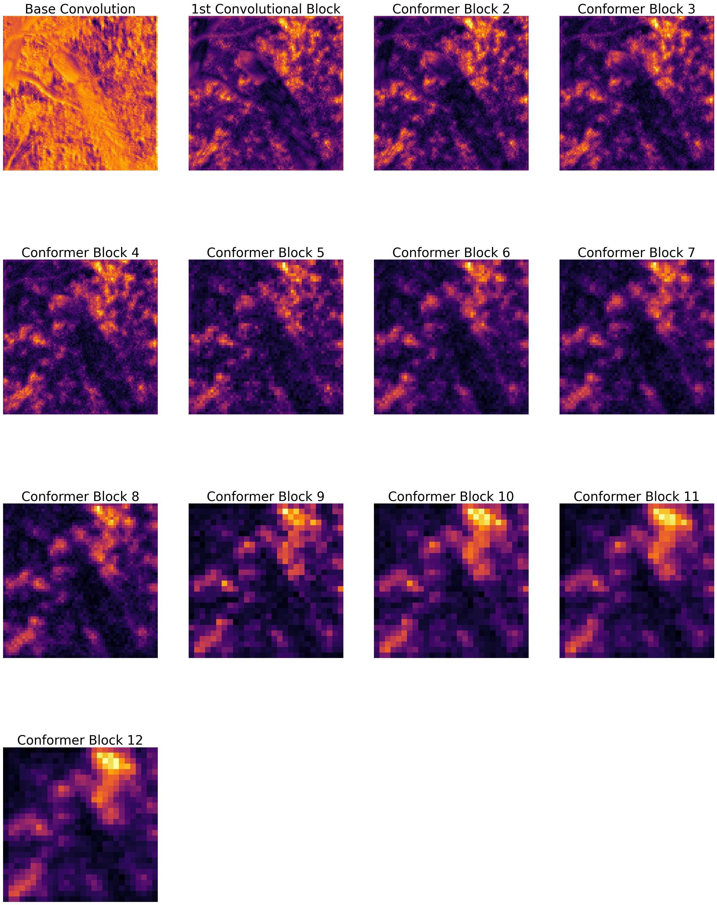

In the SimCLR directory you will find the adapted implementation of SimCLR to be able to pre-train the Conformer model in a self-supervised way.

To pretrain a conformer model using SimCLR

### pre-training conformer using SimCLR:
Simply run the following to pre-train a ResNet encoder using SimCLR on the CIFAR-10 dataset:
```
python main.py --dataset CIFAR10 --model conformer
```
the model will be saved in the directory specified at config/config.yaml


The modified implementation is also able to run a linear evaluation and TSNE with the conformer model.
```
python linear_evaluation.py --model_path=. --epoch_num=100 --logistic_batch_size=32
```

### fine-tuning conformer after SimCLR pretraining

To FineTune Conformer using a SimCLR pretrained model, specify the model path at the run.sh file and then run

```
sh run.sh
```

To visualize the feature map and attention layer output use:

```
python feature_maps.py -model_path model_path
```



