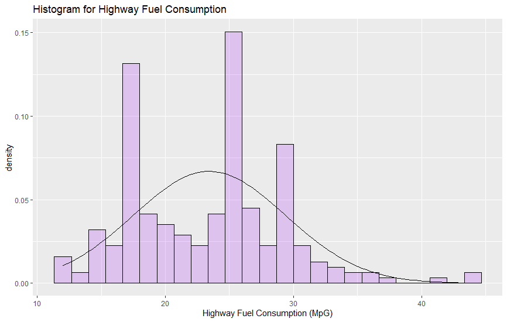

```{r setup, include=FALSE}
knitr::opts_chunk$set(echo = FALSE)
knitr::opts_chunk$set(message = FALSE)
knitr::opts_chunk$set(warning = FALSE)
```

<!-- \begin{center} -->
<!-- \vspace{100pt} -->
<!-- \includegraphics[height=0.3in]{latex_support/logo_ds.png}  -->
<!-- \end{center} -->

\begin{center}
\begin{large}
\textbf{Assignment 8}
\end{large}
\end{center}

\textbf{1. Draw a histogram of the hwy variable in the mpg dataset.}
\small
```{r, eval=FALSE, echo=TRUE}
ggplot(mpg, aes(x=hwy)) +
  geom_histogram(aes(y = ..density..),
                 bins = 10, color = "black",
                 fill = "purple", alpha = 0.2)+ 
  stat_function(fun = dnorm, args = list(mean = mean(mpg$hwy), sd = sd(mpg$hwy)))+
  labs(x= 'Highway Fuel Consumption (MpG)', title = 'Histogram for Highway Fuel Consumption')
```  
\normalsize
```{r, figures-side, fig.show='hold', out.width="50%"}
knitr::include_graphics("hist810.png")

``` 

\textbf{2. Can it be argued that the \emph{hwy} variable follows a normal distribution?}

After watching the histogram with 10 bins, it may seem that \emph{hwy} follows a normal distribution but the histogram with 25 bins clearly shows this is not the case. After performing a Shapiro-Wilk test the results confirm the claim that \emph{hwy} does not follow a normal distribution. This is clear because the fuel consumption depends on the number of cylinders and the dataset has information for several number of cylinders. Therefore, it can be expected to have two normal distributions for 4 and 8 cylinders, like in the following histogram.

```{r, out.height="25%", out.width="100%", fig.align="center"}
knitr::include_graphics("twonormal.png")
``` 

We can see that \emph{hwy} follows a multi modal distribution.


\newpage

```{r, echo=TRUE, results='hide'}
"Written by Carlos Vintimilla"
```


