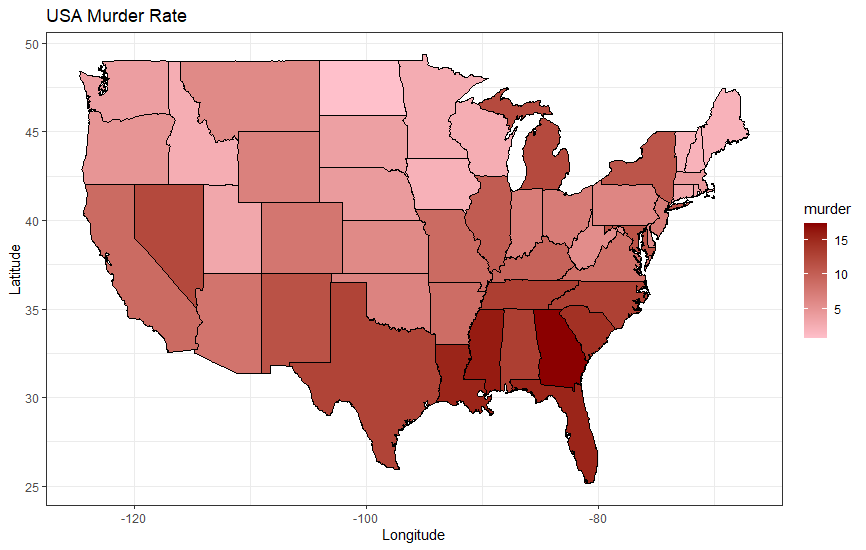

```{r setup, include=FALSE}
knitr::opts_chunk$set(echo = FALSE)
knitr::opts_chunk$set(message = FALSE)
knitr::opts_chunk$set(warning = FALSE)
```

<!-- \begin{center} -->
<!-- \vspace{100pt} -->
<!-- \includegraphics[height=0.3in]{latex_support/logo_ds.png}  -->
<!-- \end{center} -->

\begin{center}
\begin{large}
\textbf{Assignment 9}
\end{large}
\end{center}

\textbf{1. Modify the code so that states with high homicide rates are displayed in a darker red color.}

```{r, eval=FALSE, echo=TRUE}
ggplot(data, aes(fill = murder)) +
  geom_map(aes(map_id = state), map = map, color='black') +
  expand_limits(x = map$long, y = map$lat) +
  scale_fill_gradient(low = 'pink', high='darkred') + 
  labs(x= 'Longitude', y='Latitude', title='USA Murder Rate') +
  theme_bw()
```  
```{r, out.height="100%", out.width="100%", fig.align="center"}

``` 

\textbf{What}. A map of the United States showing the murder rate by state.

\textbf{Why}. To visualize which are the states and regions of the country with the higher murder rate.

\textbf{How}. An alpha scale showing darker red color for states with a higher murder rate and lower murder rates with pink. The state with the highest murder rate is Georgia, and the lowest is North Dakota.


\newpage

```{r, echo=TRUE, results='hide'}
"Written by Carlos Vintimilla"
```


