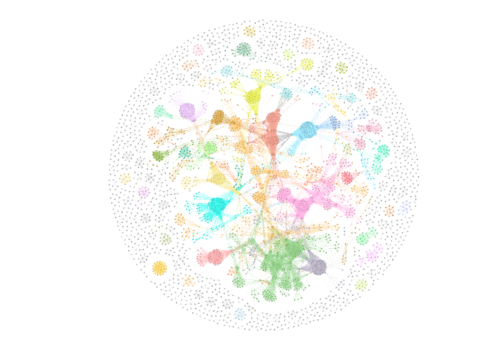
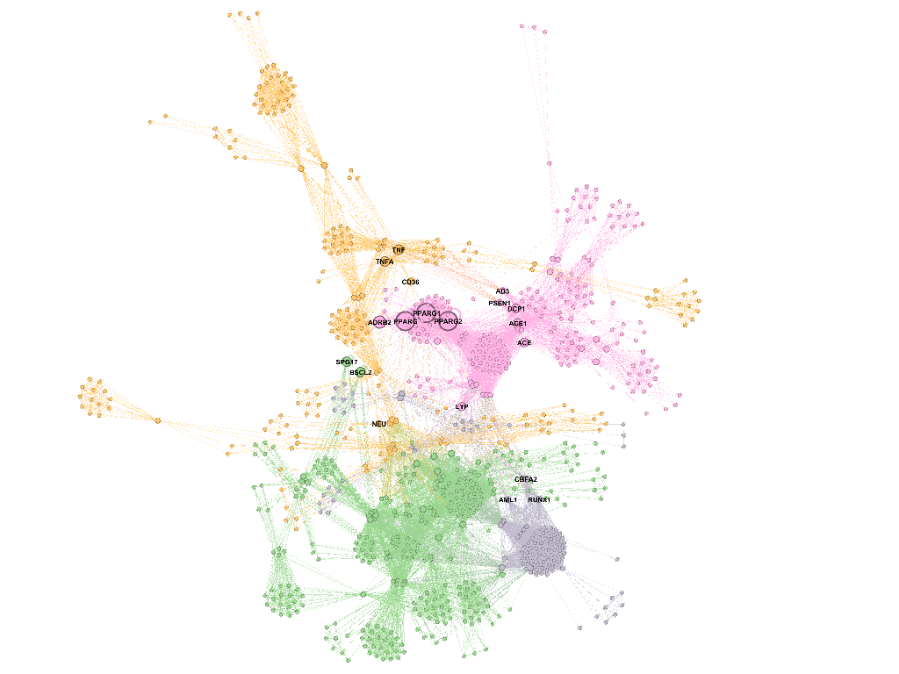

### Gephi

The gephy directory contains the matrices necessary to reconstruct a Disease Gene Network as described in Goh et.al 2007. The directory also includes the gephy file to 
draw the network. 

The network is segmented by modularity:

and allows analysis to find the most important genes for a specific disease type. For example, for metabolism related diseases the most involved genes are:

### R

In the R directory there are all the assignments from the Data Visualization class as well as two separate data visualization scripts for the Flight and MPG datasets.

### References

Goh, K. I., Cusick, M. E., Valle, D., Childs, B., Vidal, M., & Barabási, A. L. (2007). The human disease network. Proceedings of the National Academy of Sciences, 104(21), 8685-8690.
